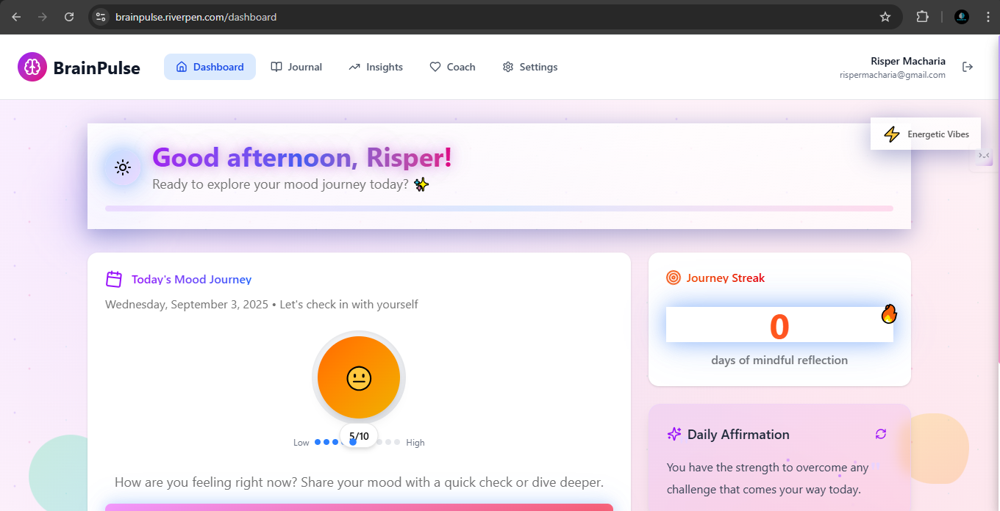
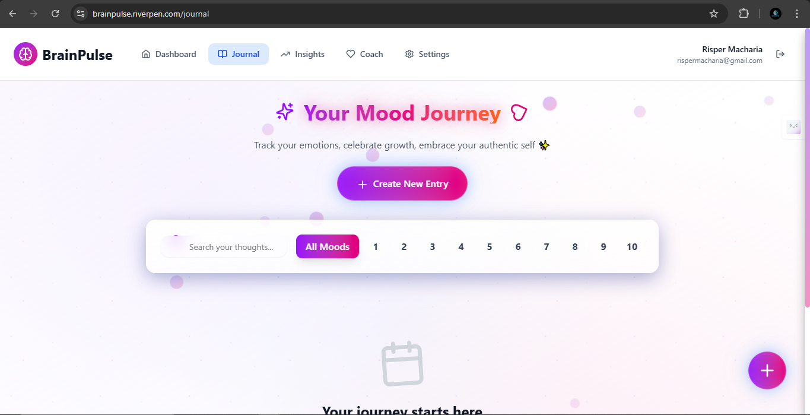
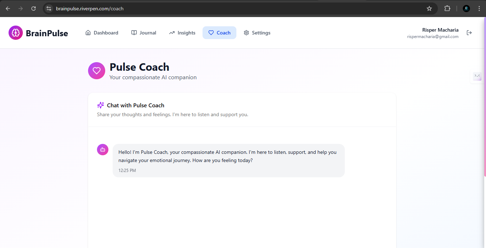
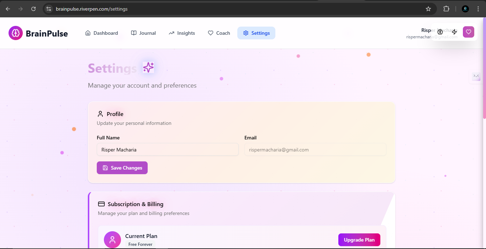
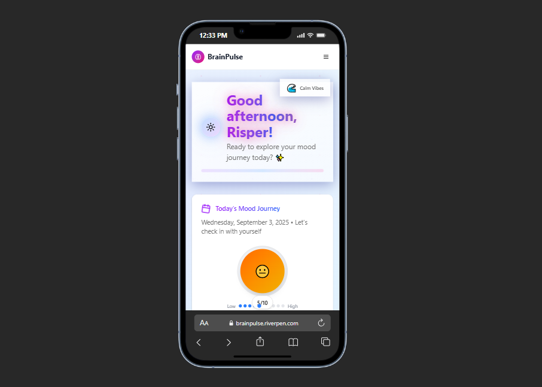

# 🌟 BrainPulse - Mood Journal Platform

> **Transform your emotional wellness journey with AI-powered insights and beautiful, personalized experiences**

<div align="center">


### 🔗 [**Live Demo**](https://brainpulse.riverpen.com) | 🎥 [**Watch Demo Video**](YOUR_DEMO_VIDEO_URL_HERE) | 📘 [**View the Pitch Deck**](https://gamma.app/docs/BrainPulse-Feel-Better-Every-Day-yoeo29lvy6dv444)

</div>

---

## ✨ What Makes This Special

A modern, AI-enhanced mood tracking platform that adapts to your personality with **dynamic theming**, **intelligent insights**, and **beautiful animations**. Whether you're tracking daily emotions or diving deep into reflection, this platform grows with you.

### 🎨 **Adaptive Themes**
- **🧠 Neutral**: Clean, balanced design for focused journaling
- **⚡ Masculine**: Bold blues and dynamic energy patterns  
- **💖 Feminine**: Warm pinks with flowing, organic animations

### 🤖 **AI-Powered Features**
- **Smart Summaries**: Gemini AI creates insightful entry summaries
- **Personalized Affirmations**: Daily encouragement tailored to your mood
- **Pattern Recognition**: Discover hidden trends in your emotional journey
- **Intelligent Prompts**: Context-aware reflection questions

---

## 🚀 Features

| Feature | Free | Basic | Premium | Professional |
|---------|------|-------|---------|--------------|
| 📝 Daily Entries | 3/day | ∞ | ∞ | ∞ |
| 📊 History Access | 7 days | 30 days | ∞ | ∞ |
| 🤖 AI Insights | ❌ | ❌ | ✅ | ✅ |
| 📈 Trend Analysis | ❌ | Basic | Advanced | Expert |
| 💾 Data Export | ❌ | ✅ | ✅ | ✅ |
| 🎯 Custom Goals | ❌ | ❌ | ✅ | ✅ |

### 🌈 Core Capabilities
- **📱 Responsive Design** - Beautiful on desktop, tablet, and mobile
- **🎭 Emotion Tracking** - Tag and visualize complex emotional states
- **📊 Visual Analytics** - Interactive charts and mood patterns
- **🔔 Smart Notifications** - Gentle reminders that respect your schedule
- **🛡️ Privacy First** - Your data stays secure with optional export
- **⚡ Real-time Updates** - Smooth, animated interactions

---

## 🛠️ Tech Stack

<div align="center">

| Frontend | Backend | Database | AI/ML |
|----------|---------|----------|-------|
|  | |  |  |
|  |  |  |  |
|  |  | |  |
|  | | | |

</div>

---

## 🎯 Quick Start

### Prerequisites
- Node.js 18+
- PostgreSQL database
- Gemini AI API key

### Installation

```bash
# Clone the repository
git clone https://github.com/Washington-NKE/plp_hackerthon_brainpulse.git
cd plp_hackerthon_brainpulse.git

# Install dependencies
npm install

# Set up environment variables
cp .env.example .env.local
# Add your database URL, NextAuth secret, and Gemini API key

# Set up database
npx prisma generate
npx prisma db push

# Start development server
npm run dev
```

### Environment Variables

```env
DATABASE_URL="postgresql://..."
NEXTAUTH_SECRET="your-secret-here"
NEXTAUTH_URL="http://localhost:3000"
GEMINI_API_KEY="your-gemini-api-key"
```

---

## 📱 Screenshots

<div align="center">

| 🏠 Dashboard | 📝 Journal Entry | 📊 AI Coach |
|--------------|------------------|--------------|
|  |  |  |

| ⚙️ Settings | 🎨 Themes | 📱 Mobile |
|-------------|-----------|-----------|
|  |  |  |

</div>

---

## 🎨 Design Philosophy

### **Emotional Intelligence Through Design**
- **Adaptive UI**: Interface adapts to your emotional state and preferences
- **Micro-interactions**: Every click, hover, and transition feels intentional
- **Accessibility First**: WCAG compliant with high contrast and screen reader support
- **Performance Optimized**: Smooth 60fps animations without compromising speed

### **Privacy & Trust**
- **Local-first**: Sensitive data processed locally when possible
- **Transparent AI**: Clear explanations of how AI insights are generated
- **Data Ownership**: Full export and deletion capabilities
- **Secure Authentication**: Industry-standard auth with NextAuth.js

---

## 🤝 Contributing

This is a personal project, but I welcome feedback and suggestions! Feel free to:

- 🐛 Report bugs via Issues
- 💡 Suggest features or improvements  
- ⭐ Star the repo if you find it useful
- 🔄 Share your experience using the platform

---

## 👨‍💻 About the Creator

**Washington Mwangi** | Solo Developer & Mental Wellness Advocate

> *"Built with passion to help people understand and improve their emotional wellbeing through technology"*

### 🛠️ Development Journey
- **Primary Development**: Solo development with modern web technologies
- **AI Assistance**: 
  - **V0**: Rapid UI component prototyping and design inspiration
  - **Claude Sonnet 4**: Complex logic implementation and code architecture
  - **Gemini AI**: Integrated for intelligent mood analysis and insights

### 📍 Connect
- 🌍 **Location**: Nyeri, Kenya
- 💼 **LinkedIn**: [www.linkedin.com/in/washingtonmwangi]
- 🐦 **Twitter**: [https://x.com/Washington_M_M?t=OnElsXmBz-ChtQm8RoqMw&s=09]
- 📧 **Email**: [washiem2022@gmail.com]

---

## 🙏 Acknowledgments

- **Google Gemini AI** for powering intelligent insights
- **Anthropic Claude** for development assistance and code review
- **Vercel V0** for rapid UI prototyping
- **The Open Source Community** for amazing tools and libraries

---

<div align="center">

### 🌟 **Made with ❤️ for mental wellness** 🌟

**"Every emotion matters. Every day counts. Every journey is unique."**


</div>
